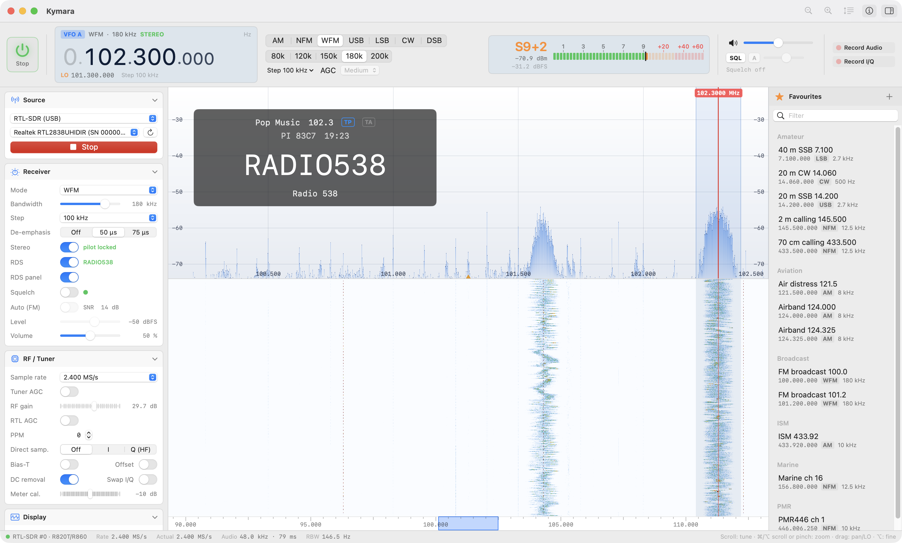

# Kymara

Native macOS receiver for RTL-SDR dongles (Apple silicon), inspired by SDR Console.
Swift + SwiftUI, DSP with Accelerate/vDSP, spectrum and waterfall rendered on the GPU with Metal.

<picture>
  <source media="(prefers-color-scheme: dark)" srcset="docs/screenshot-dark.png">
  
</picture>

## Building and running

```bash
brew install librtlsdr          # only needed to build/bundle; the .app then ships its own librtlsdr + libusb
./scripts/build-app.sh          # → build/Kymara.app
open "build/Kymara.app"
```

During development: `swift run -c release Kymara`. Tests: `swift test -c release`.

## Features

**Sources:** RTL-SDR over USB, rtl_tcp (network), I/Q files (WAV 8/16-bit/float, raw `.cu8`) and a
demo generator with FM broadcast, AM, NFM, SSB and CW signals, so everything also works without hardware.

**Receiver:** AM, NFM, WFM (stereo with a 19 kHz pilot PLL, 50/75 µs de-emphasis), USB, LSB, CW (adjustable
pitch) and DSB. Adjustable bandwidth (presets or by dragging the filter edges), tuning step, AGC
(off/fast/medium/slow) or manual AF gain, squelch with hysteresis (level, or auto on carrier-to-noise ratio in FM modes), volume/mute.

**RDS (WFM):** programme service name, PI code, programme type, TP/TA, RadioText and clock time, with
error correction of short bursts. Shown as a panel over the spectrum; new favourites are named after the station.

**RF/tuner:** sample rate 0.25–3.2 MS/s, RF gain or tuner AGC, RTL AGC, PPM correction, direct sampling (HF),
bias-T, offset tuning, DC correction, I/Q swap, overload indicator.

**Display (Metal):** spectrum with fill, peak hold and max-per-pixel rendering; waterfall with 6 palettes,
adjustable speed and levels, which shifts correctly when retuning; FFT 1k–64k, averaging, zoom up to ×256,
auto range. S-meter (S1–S9+60, estimated dBm and dBFS, peak and squelch markers). Light, dark or system theme.

**Recording:** audio (16-bit stereo WAV) and I/Q (8-bit WAV, playable as a file source), saved to
`~/Music/Kymara Recordings`.

**Favourites:** grouped, filterable, editable.

**Settings** are saved automatically to `~/Library/Preferences/nl.pa3jh.kymara.plist` and survive updates.
Each field is read on its own (missing or unknown → default value), favourites are stored under their own key,
and unreadable data is backed up instead of overwritten.

## Controls

| Action | Spectrum / waterfall |
|---|---|
| Click | Tune (rounded to the tuning step; ⌥ = exact) |
| Drag the passband | Move the VFO |
| Drag a filter edge | Bandwidth |
| Drag the background | Pan (when zoomed) or move the LO |
| Scroll | Tune by one step |
| ⌘/⌥ + scroll, pinch | Zoom around the cursor |
| ← / → (⇧ = ×10) | Tune; ↑/↓ zoom |
| Right-click | Context menu |

Frequency display: scroll over a digit to change it, click its upper/lower half for +/−,
double-click or type a number (⌘F) to enter a frequency (`145.5`, `7100k`, `1.09G`).
Shortcuts: ⌘R start/stop, ⌘1–7 modes, ⌘D add favourite, ⌘=/⌘−/⌘0 zoom, ⇧⌘A/⇧⌘I record.

## Architecture

- `Sources/SDRCore` — sources (librtlsdr via `dlopen`, rtl_tcp, file, demo), DSP chain
  (NCO → decimation to ~240 kHz → channel filter (overlap-save FFT) → demodulation → ~48 kHz audio, plus the RDS decoder on the FM multiplex),
  spectrum analysis, audio output (AVAudioEngine) and recording.
- `Sources/Kymara` — SwiftUI app, `RadioController` (state and settings), Metal renderers, persistence.

The DSP processes 1 s of 2.4 MS/s in ~15–25 ms on Apple silicon.
